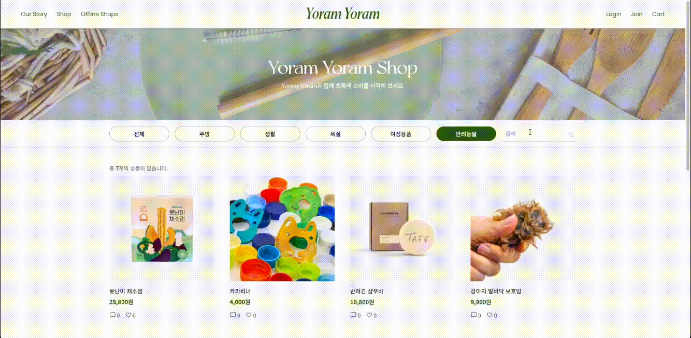
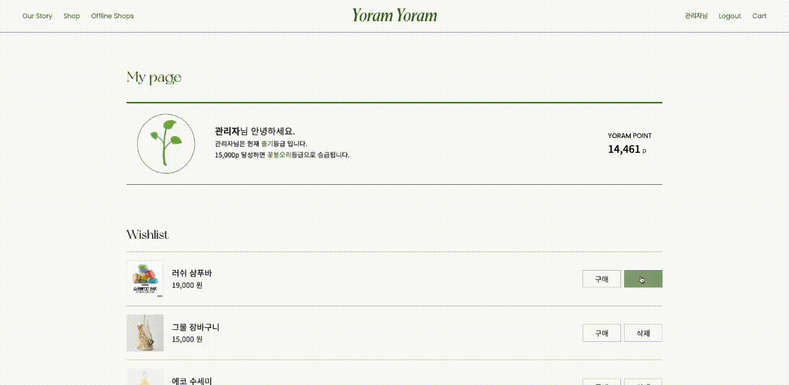
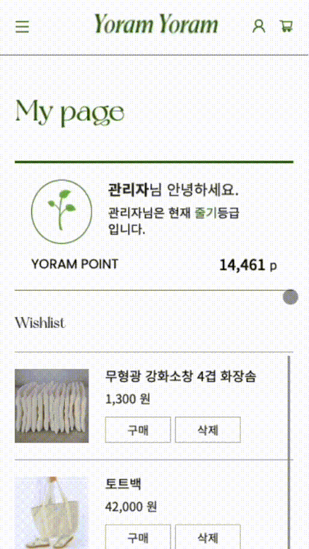
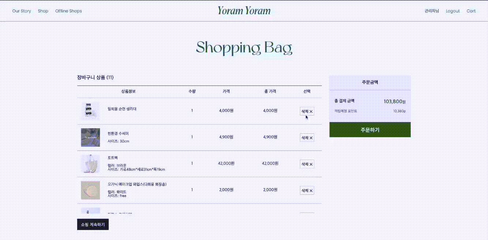
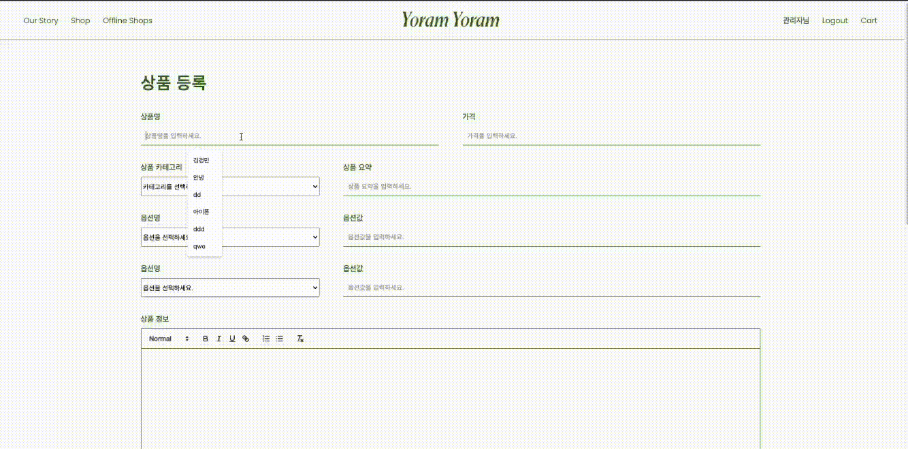

# TEAM LOGO

<div align="center">

</div>

# 서비스 기획의도

📌 최근 매장 내 빨대 없애기, 편의점 비닐봉투 사용금지 등 많은 기업들도 환경보호에 관심을 가지면서

요즘 우리의 가장 큰 관심사 중 하나는 ‘쓰레기 줄이기’입니다.

저희 ‘요람요람🌎’ 도 이런 시대의 흐름에 발맞춰 쓰레기를 최소화하자는 ‘Zero-Waste’ 운동을 소비자들에게 알리고

이를 개개인의 생활로까지 이끌어낼 수 있도록 하자는 취지를 가지고 있습니다.

팀명인 ‘요람요람’은 관용어 중에 처음부터 끝까지를 의미하는 ‘요람부터 무덤까지’라는 어구를 착안해

한번 사용한 상품들을 버리는 것이 아니라 다시 다음 생산의 재료로 쓰는 ‘요람 to 요람’ 시스템을 만들자는 의미입니다.

저희 서비스에서는 서울지역의 제로웨이스팅 상점들을 소개시켜주고,

제로웨이스팅 상품들을 온라인에서도 거래할 수 있는 온라인 샵을 마련함으로써 소비자들의 제로웨이스팅 생활화를 도모하고자 합니다.

<br><br>

# 팀원 소개


<br><br>

<br><br>

# 시연 GIF

메인페이지

<div style="display:flex;flex-direction:row;justify-content:space-between;align-items:center">
  
  
</div>

<br>

<br>

---

소개페이지

<div style="display:flex;flex-direction:row;justify-content:space-between;align-items:center">
  
  
</div>

<br>

<br>

---

회원가입

<div style="display:flex;flex-direction:row;justify-content:space-between;align-items:center">
  
  
</div>

<br>

<br>

---

로그인페이지

<div style="display:flex;flex-direction:row;justify-content:space-between;align-items:center">
  
  
</div>

<br>

<br>

---

오프라인 지도([스마트서울맵 api](https://map.seoul.go.kr/smgis2/openApi)사용)

<div style="display:flex;flex-direction:row;justify-content:space-between;align-items:center">
  
  
</div>

<br>

<br>

---

상품목록

<div style="display:flex;flex-direction:row;justify-content:space-between;align-items:center">
  
  
</div>

<br>

<br>

상품검색

<div style="display:flex; justify-content:center;">
  
</div>

<br>

<br>

---

상품 상세페이지

<div style="display:flex;flex-direction:row;justify-content:space-between;align-items:center">
  
  
</div>

<br>

<br>

---

찜목록

<div style="display:flex;flex-direction:row;justify-content:space-between;align-items:center">
  
  
</div>

<br>

<br>

---

장바구니

<div style="display:flex;flex-direction:row;justify-content:space-between;align-items:center">
  
  
</div>

<br>

<br>

---

상품등록

<div style="display:flex;flex-direction:row;justify-content:space-between;align-items:center">
  
  
</div>

<br>

<br>

# 기술 스택


<br><br>

```

<br><br>

# .env

```

# DB INFO on DOCKER

DATABASE_TYPE
DATABASE_HOST
DATABASE_PORT
DATABASE_USERNAME
DATABASE_PASSWORD
DATABASE_DATABASE

# TOKEN SECRET

JWT_ACCESS_SECRET
JWT_REFRESH_SECRET

IAMPORT_KEY
IAMPORT_SECRET

```

```
